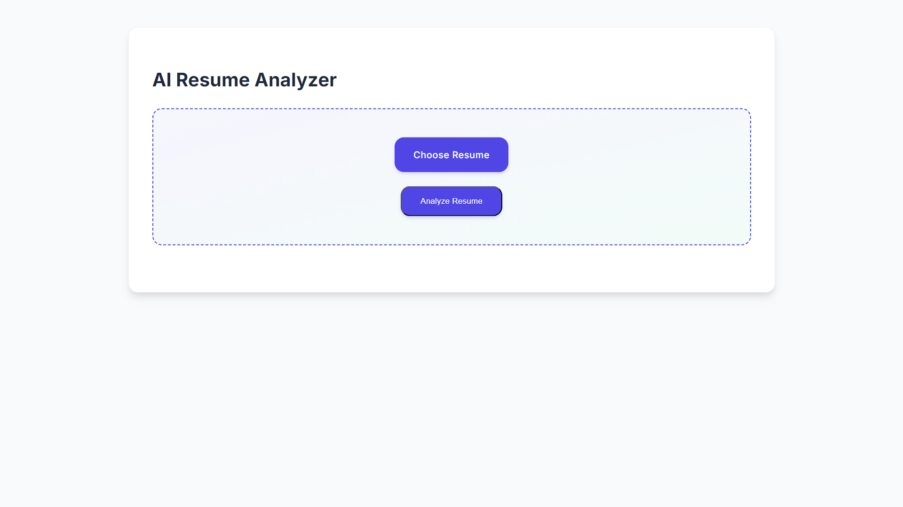

# AI Resume Optimizer

AI Resume Optimizer is a web-based application that analyzes resumes and provides an ATS-style score on a scale of 1 to 100. It also suggests improvements to enhance resume effectiveness for job applications.

AI Resume Optimizer

AI Resume Optimizer Result 

## Table of Contents

- [Features](#features)
- [Installation](#installation)
- [Usage](#usage)
- [How It Works](#how-it-works)
- [Technologies Used](#technologies-used)
- [Contributing](#contributing)

## Features

- **ATS-Style Scoring**: Evaluates resumes and assigns a score from 1 to 100 based on content relevance.
- **Skill Extraction**: Identifies key technical and soft skills.
- **Education & Experience Analysis**: Extracts educational qualifications and work experience details.
- **Contact Information Validation**: Detects missing or incorrect email, phone, and LinkedIn details.
- **Improvement Suggestions**: Provides actionable feedback for resume enhancement.
- **Job Keyword Matching**: Analyzes resume content against job descriptions to highlight keyword alignment.

## Installation

1. Clone the repository to your local machine:
   ```bash
   git clone https://github.com/Soumo-git-hub/AI-Resume-Optimizer.git
   ```
2. Navigate to the project directory:
   ```bash
   cd AI-Resume-Optimizer
   ```
3. Create and activate a virtual environment:
   ```bash
   python -m venv venv
   source venv/bin/activate  # On Windows use `venv\Scripts\activate`
   ```
4. Install the required dependencies:
   ```bash
   pip install -r requirements.txt
   ```
5. Run the application:
   ```bash
   python app.py
   ```

## Usage

1. Upload your resume (PDF or DOCX format) via the web interface.
2. The AI will analyze the resume and display the ATS score.
3. Review the extracted details, including skills, experience, and contact information.
4. Compare your resume with job descriptions to check for missing keywords.
5. Read the improvement suggestions to optimize your resume for job applications.

## How It Works

- **Text Extraction**: Extracts text from PDF/DOCX files.
- **Natural Language Processing (NLP)**: Uses spaCy to analyze resumes and identify key attributes.
- **Scoring System**: Evaluates resume sections based on predefined criteria.
- **Feedback Mechanism**: Highlights missing or weak sections and provides improvement suggestions.
- **Job Matching Algorithm**: Compares resume content with job descriptions and highlights relevant keywords.

## Technologies Used

- **Python**: Core programming language.
- **Flask**: Web framework for building the application.
- **spaCy**: NLP library for text analysis.
- **pdfminer & python-docx**: For extracting text from PDFs and DOCX files.
- **Bootstrap**: Frontend framework for a responsive UI.
- **Jinja2**: Templating engine for dynamic content rendering.

## Contributing

Contributions are welcome! To contribute:

1. Fork the repository.
2. Create a new branch for your feature or fix.
3. Make your changes and commit them with descriptive messages.
4. Push your changes to your forked repository.
5. Create a pull request to the main repository.

##